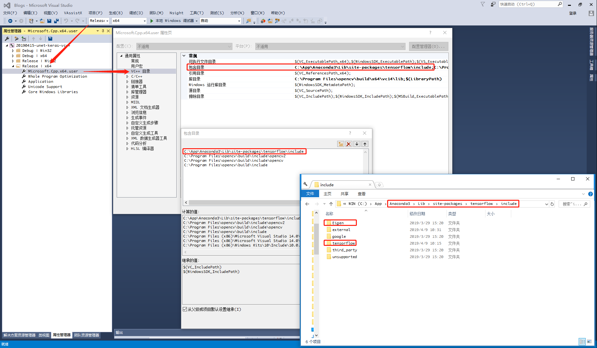
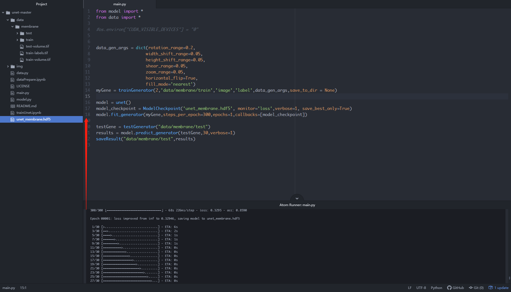
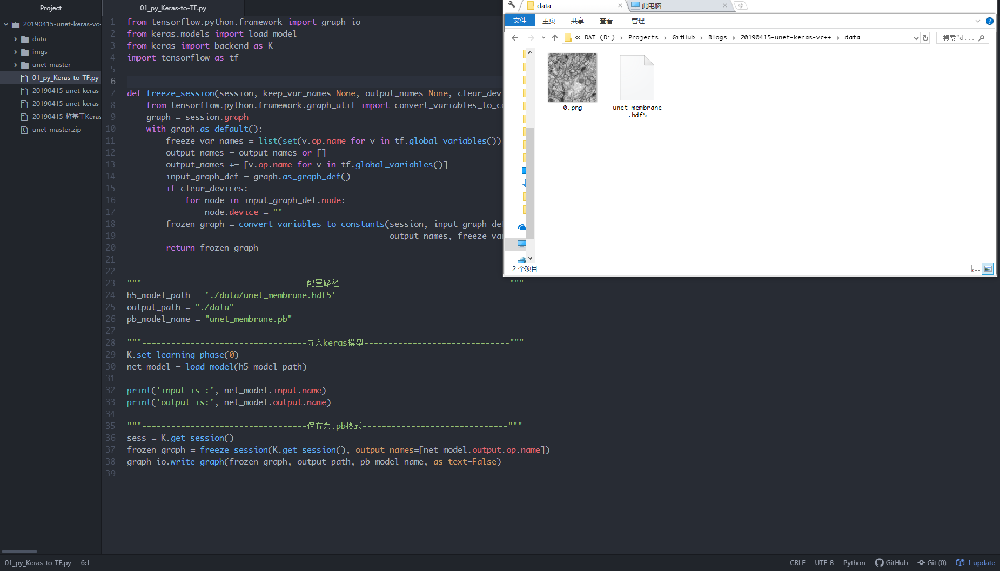
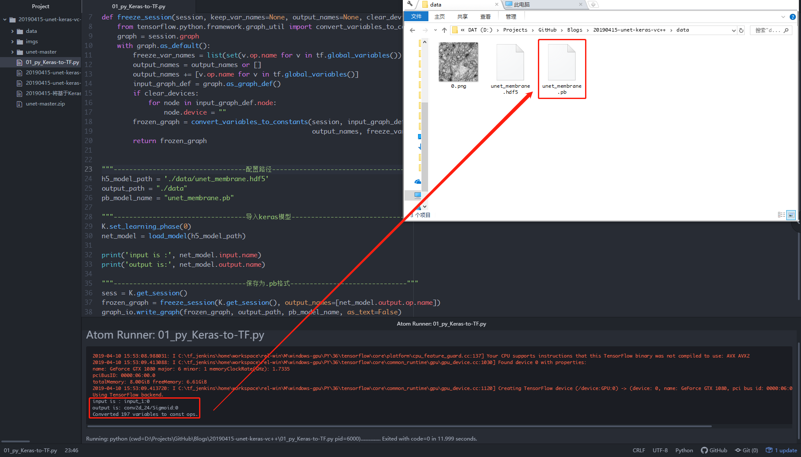
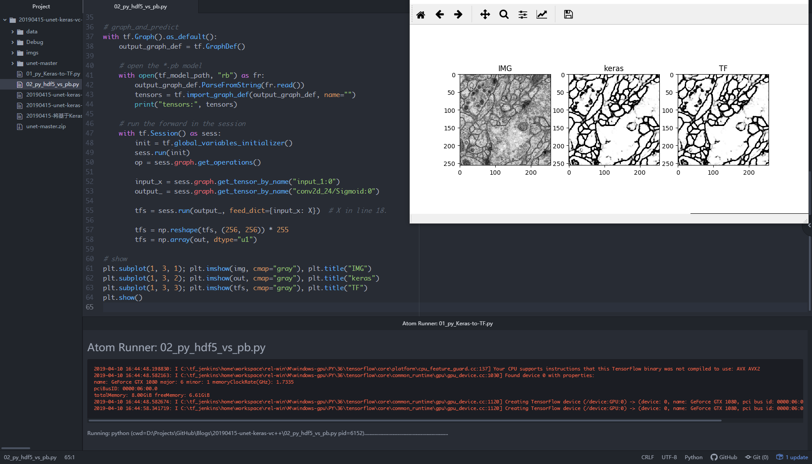
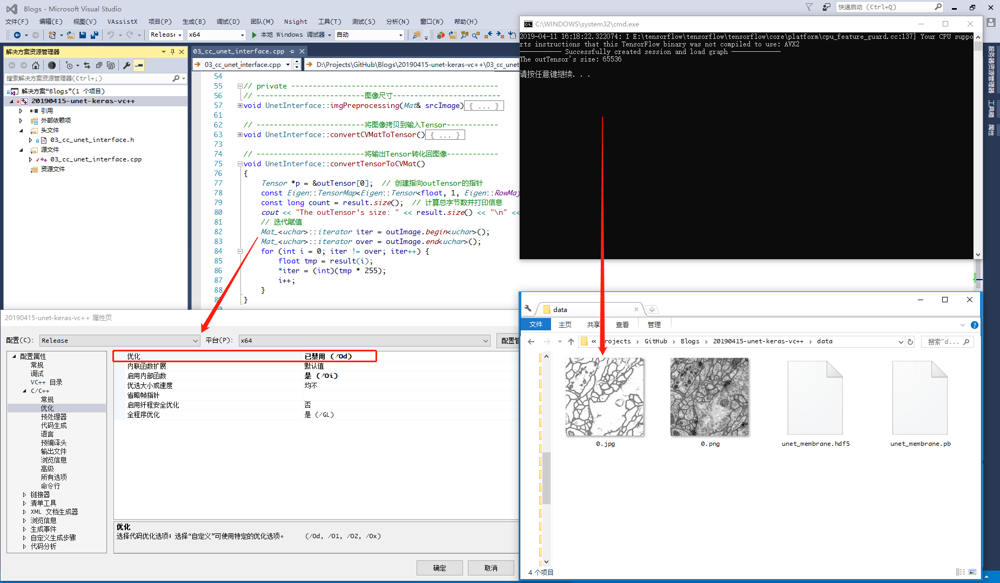
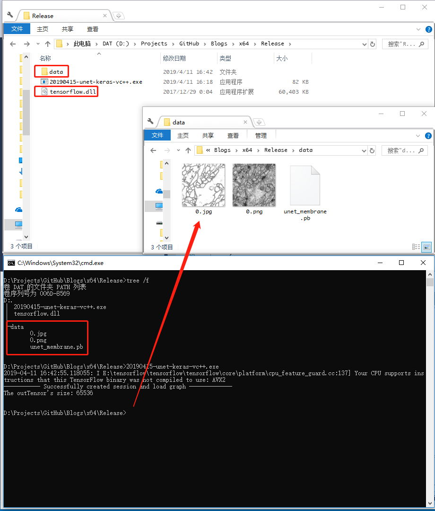

# 20190415-将基于Keras训练的Unet模型通过TensorFlow的C++接口部署

## 1. 前言

自学深度学习一段时间有余，从最初的一无所知到如今完成几个实际应用走了很多弯路，作为小白通过Keras入门是最好的选择之一，但项目落地过程中却遭遇了诸多问题。

因为项目需要和诸多运行在工厂车间的老系统做对接，但个人却比较熟悉用Python做研发工具。一开始用了一个比较笨拙的方法：基于socket通信将Python程序通过Pyinstaller工具打包为一个server.exe，然后挂到生产系统中，在客户端通过json做请求参数并调用。

无意中看到博文：[《用keras训练模型并用Tensorflow的C++API调用模型》](<https://blog.csdn.net/qq_25109263/article/details/81285952>)，作者给出了很好的解决方案：keras训练 -> *.h5 -> 转化为*.pb -> 利用TF(C++)API调用，个人实践了一番亲测可用，但最近的项目更多是语义分割相关的，故选用UNet并主要结合原博主代码再次实践了一遍后记录到此文中。

## 2. 环境

* Win10，CPU
* Visual Studio 2015

* Anaconda（Python3.6）
* pip install tensorflow==1.4.0 
* pip install keras==2.1.5 （此处补一句，较高版本的tf自带keras接口）

有前面的工具后，接下来还需要准备好 TF(C++)API 接口所需的 头文件、tensorflow.lib、tensorflow.dll 这三者。本文将跳过原文作者的源码编译过程，直接用准备好的（个人是直接从网络下载别人编译好的cpu版本，因为gpu版本需要和GPU环境适配故在此略过）。在库的使用中主要包括OpenCV、Eigen、Tensorflow，因此头文件也主要是这三类，入门CV必备的OpenCV配置略过不讲，而后两者竟然在pip安装的tensorflow子目录中竟然有，索性投机取巧如下图所示直接包含其整个include，但部分缺少的头文件还需要从github荡到对应版本按照目录结构放到对应位置即可。



## 3. 模型

直接搜索“keras unet github”关键词指向 [zhixuhao/unet](https://github.com/zhixuhao/unet) 下载整个工程，执行其中的```main.py```脚本得到keras的*.hdf5格式模型如下图所示：



然后将此*.hdf5模型拷贝出来，此外准备一张测试用图，开始我们的第一段代码：模型转化！

```python
from tensorflow.python.framework import graph_io
from keras.models import load_model
from keras import backend as K
import tensorflow as tf


def freeze_session(session, keep_var_names=None, output_names=None, clear_devices=True):
    from tensorflow.python.framework.graph_util import convert_variables_to_constants
    graph = session.graph
    with graph.as_default():
        freeze_var_names = list(set(v.op.name for v in tf.global_variables()).difference(keep_var_names or []))
        output_names = output_names or []
        output_names += [v.op.name for v in tf.global_variables()]
        input_graph_def = graph.as_graph_def()
        if clear_devices:
            for node in input_graph_def.node:
                node.device = ""
        frozen_graph = convert_variables_to_constants(session, input_graph_def,
                                                      output_names, freeze_var_names)
        return frozen_graph


"""----------------------------------配置路径-----------------------------------"""
h5_model_path = './data/unet_membrane.hdf5'
output_path = "./data"
pb_model_name = "unet_membrane.pb"

"""----------------------------------导入keras模型------------------------------"""
K.set_learning_phase(0)
net_model = load_model(h5_model_path)

print('input is :', net_model.input.name)
print('output is:', net_model.output.name)

"""----------------------------------保存为.pb格式------------------------------"""
sess = K.get_session()
frozen_graph = freeze_session(K.get_session(), output_names=[net_model.output.op.name])
graph_io.write_graph(frozen_graph, output_path, pb_model_name, as_text=False)

```

如下图所示在整个过程中会加载原有的*.hdf5模型并转化为*.pb模型，尤其注意打印的输入和输出节点名字！





## 4. 校验

现在我们同时有了Keras可用的*.hdf5模型和TensorFlow所用的*.pb模型，可以通过如下第二个脚本比较转化后的是否工作正常。

```python
"""------------------------keras-hdf5------------------------"""
from keras.models import load_model
import matplotlib.pyplot as plt
import numpy as np
import cv2

# data
img_path = "./data/0.png"
img = cv2.imread(img_path, 0)

# model
keras_model_path = "./data/unet_membrane.hdf5"
unet = load_model(keras_model_path)

# prepare_and_predict
img = img / 255
img = cv2.resize(img, (256, 256))
X = np.reshape(img, (1, 256, 256, 1))
y = unet.predict(X)
out = np.reshape(y, (256, 256)) * 255
out = np.array(out, dtype="u1")
print("img.shape: %s, out.shape: %s" % (img.shape, out.shape))

# show
plt.subplot(1, 2, 1); plt.imshow(img, cmap="gray")
plt.subplot(1, 2, 2); plt.imshow(out, cmap="gray")
plt.suptitle("keras-hdf5"); plt.show()


"""------------------------tensorflow-pb------------------------"""
import tensorflow as tf

# model
tf_model_path = "./data/unet_membrane.pb"

# graph_and_predict
with tf.Graph().as_default():
    output_graph_def = tf.GraphDef()

    # open the *.pb model
    with open(tf_model_path, "rb") as fr:
        output_graph_def.ParseFromString(fr.read())
        tf.import_graph_def(output_graph_def, name="")

    # run the forward in the session
    with tf.Session() as sess:
        sess.run(tf.global_variables_initializer())  # init
        inp_tensor = sess.graph.get_tensor_by_name("input_1:0")
        out_tensor = sess.graph.get_tensor_by_name("conv2d_24/Sigmoid:0")
        npy_tensor = sess.run(out_tensor, feed_dict={inp_tensor: X})  # X in line 18.
        # postprocessing
        npy = np.reshape(npy_tensor, (256, 256)) * 255
        npy = np.array(npy, dtype="u1")

# show
plt.subplot(1, 3, 1); plt.imshow(img, cmap="gray"), plt.title("IMG")
plt.subplot(1, 3, 2); plt.imshow(out, cmap="gray"), plt.title("keras")
plt.subplot(1, 3, 3); plt.imshow(npy, cmap="gray"), plt.title("TF")
plt.show()

```

运行后如下图所示，可以看到二者结果基本并无差异。



## 5. VC++工程

考虑到生产过程中算法这块儿主要通过dll交付，通过定义对应的接口类并在类的构造函数中完成模型参数的加载以及提供计算调用接口是较通用的方式（总不能计算一次就加载一次模型），整个头文件设计如下：

```cpp
#pragma once
#define COMPILER_MSVC
#define NOMINMAX
#include <fstream>
#include <utility>
#include <iostream>
#include <Eigen/Core>
#include <Eigen/Dense>

#include "tensorflow/cc/ops/const_op.h"
#include "tensorflow/cc/ops/image_ops.h"
#include "tensorflow/cc/ops/standard_ops.h"
#include "tensorflow/core/framework/tensor.h"
#include "tensorflow/core/framework/graph.pb.h"
#include "tensorflow/core/graph/default_device.h"
#include "tensorflow/core/graph/graph_def_builder.h"
#include "tensorflow/core/public/session.h"
#include "tensorflow/core/lib/io/path.h"
#include "tensorflow/core/lib/core/errors.h"
#include "tensorflow/core/lib/core/threadpool.h"
#include "tensorflow/core/lib/core/stringpiece.h"
#include "tensorflow/core/lib/strings/stringprintf.h"
#include "tensorflow/core/util/command_line_flags.h"
#include "tensorflow/core/platform/init_main.h"
#include "tensorflow/core/platform/logging.h"
#include "tensorflow/core/platform/types.h"
#include "tensorflow/core/platform/env.h"

#include "opencv2/opencv.hpp"

using tensorflow::Flag;
using tensorflow::int32;
using tensorflow::Tensor;
using tensorflow::Status;
using tensorflow::string;
using namespace tensorflow;
using namespace tensorflow::ops;

using namespace std;
using namespace cv;

// 定义UnetInterface类
class UnetInterface
{
public:
	/*
	---------------------变量---------------------
	*/
	UnetInterface(string model_path);
	/*
	---------------------方法---------------------
	*/
	int predict(string img_path, Mat& dstImage);

private:
	/*
	---------------------变量---------------------
	*/
	string inp_tensor_name;  // 输入节点名字
	string out_tensor_name;  // 输出节点名字

	Session* session;  // 定义session
	GraphDef graphdef;  // 定义graph

	// 定义输入输入图像
	int img_side = 256;  // 输入尺寸
	Mat inpImage = Mat(img_side, img_side, CV_8UC1);
	Mat outImage = Mat(img_side, img_side, CV_8UC1);

	// 定义输入输出张量
	cv::Mat inpFloatMat;  // inpImage -> inpFloatMat
	Tensor inpTensor = Tensor(DT_FLOAT, TensorShape({ 1, img_side, img_side, 1 }));  // 输入张量
	vector<tensorflow::Tensor> outTensor;

	/*
	---------------------方法---------------------
	*/
	void imgPreprocessing(Mat& src);
	void convertCVMatToTensor();
	void convertTensorToCVMat();
};

```

如前言所述主要使用了OpenCV、Eigen、TensorFlow，都需要正确include到工程中。

在类的定义中：

* 类的构造函数可以通过传入模型路径进行加载
* 暴露出来的predict函数可以接受传入图像并返回unet语义分割结果图像
* 其它隐藏起来的主要包括把传入图像resize到模型能接受的尺寸，以及将图像转为Tensor作为输入和将输出Tensor转为图像的方法

接着是类的实现代码（注意第一行加载tensorflow.lib的部分），主函数调用放在了最后，运行时tensorflow.lib、tensorflow.dll要跟运行程序放在同一目录中（当然还有图像和模型的路径也要正确）。

```cpp
#pragma comment(lib, "./tensorflow.lib")
#include "03_cc_unet_interface.h"

// public --------------------------------------------------
// -------------------------构造函数-------------------------
UnetInterface::UnetInterface(string model_path)
{
	// 配置模型的输入输出节点名字
	inp_tensor_name = "input_1:0";
	out_tensor_name = "conv2d_24/Sigmoid:0";

	// 加载模型到计算图
	Status status_load = ReadBinaryProto(Env::Default(), model_path, &graphdef);
	if (!status_load.ok()) {
		cout << "ERROR: Loading model failed..." << endl;
		cout << model_path << status_load.ToString() << "\n";
	}

	// 创建会话
	NewSession(SessionOptions(), &session);
	Status status_create = session->Create(graphdef);
	if (!status_create.ok()) {
		cout << "ERROR: Creating graph in session failed.." << status_create.ToString() << endl;
	}
	else {
		cout << "----------- Successfully created session and load graph -------------" << endl;
	}

}

// -------------------------模型计算-------------------------
int UnetInterface::predict(string img_path, Mat& dstImage)
{
	// 读取图像 -> 输入图像
	Mat srcImage = imread(img_path, 0);  // 以灰度图模式打开
	if (srcImage.empty()) {  // 校验是否正常打开待操作图像!
		cout << "can't open the image!!!!!!!" << endl;
		return -1;
	}
	imgPreprocessing(srcImage);  // 预处理
	// 输入图像 -> 输入张量
	convertCVMatToTensor();
	// 输入张量 -> 输出张量
	Status status_run = session->Run({ {this->inp_tensor_name, inpTensor} }, { out_tensor_name }, {}, &outTensor);
	if (!status_run.ok()) {
		cout << "ERROR: RUN failed..." << std::endl;
		cout << status_run.ToString() << "\n";
		return -1;
	}
	// 输出张量 -> 输出图像
	convertTensorToCVMat();
	outImage.copyTo(dstImage);
}

// private ------------------------------------------------
// -------------------------图像尺寸-------------------------
void UnetInterface::imgPreprocessing(Mat& srcImage)
{
	resize(srcImage, inpImage, cv::Size(img_side, img_side));  // 尺寸缩放
}

// -------------------------将图像拷贝到输入Tensor------------
void UnetInterface::convertCVMatToTensor()
{
	inpImage.copyTo(inpFloatMat);  // 拷贝
	inpFloatMat.convertTo(inpFloatMat, CV_32FC1);  // 类型转化
	inpFloatMat = inpFloatMat / 255;  // 数值归一化

	float *p = (&inpTensor)->flat<float>().data();  //创建指向inpTensor内容的指针
	cv::Mat tensorMat(img_side, img_side, CV_32FC1, p);  // 创建一个与inpTensor地址绑定的tensorMat
	inpFloatMat.convertTo(tensorMat, CV_32FC1);  // 通过拷贝inpFloatMat至tensorMat来填充inpTensor
}

// -------------------------将输出Tensor转化回图像------------
void UnetInterface::convertTensorToCVMat()
{
	Tensor *p = &outTensor[0];  // 创建指向outTensor的指针
	const Eigen::TensorMap<Eigen::Tensor<float, 1, Eigen::RowMajor>, Eigen::Aligned>& result = p->flat<float>();
	const long count = result.size();  // 计算总字节数并打印信息
	cout << "The outTensor's size: " << result.size() << "\n" << endl;
	// 迭代赋值
	Mat_<uchar>::iterator iter = outImage.begin<uchar>();
	Mat_<uchar>::iterator over = outImage.end<uchar>();
	for (int i = 0; iter != over; iter++) {
		float tmp = result(i);
		*iter = (int)(tmp * 255);
		i++;
	}
}

/*
--------------------------------------------------------------------------------------------------------------------
*/

int main(int aargc, char** argv)
{
	UnetInterface unet = UnetInterface("./data/unet_membrane.pb");
	Mat dstImage;  // 定义输出图像
	unet.predict("./data/0.png", dstImage);
	imwrite("./data/0.jpg", dstImage);
	return 0;
}
```

强调一下生产时所用的python端tf版本与c++端的版本一致，此外如果打包用的Release(x64)得到的tf.dll那么在本程序的调试/执行也要对应到这个平台。

最后再次感谢原作者提供的方案，个人只是做了一点修改和整理以提供unet语义分割模型的调用，运行结果如下：



还需注意一个问题，在上图的代码使用迭代器的过程中发现其被编译器优化掉（暂不理解个中原理），需要在属性配置中将优化禁用掉即可正常运行。

最后可以在X64/Release目录中将所需tensorflow.dll和data拷贝过去，可见其正常工作。



## 6. 附注

所有代码已放置个人github：<https://github.com/atlantistin/Blogs>