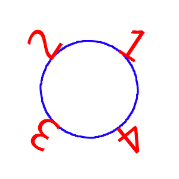
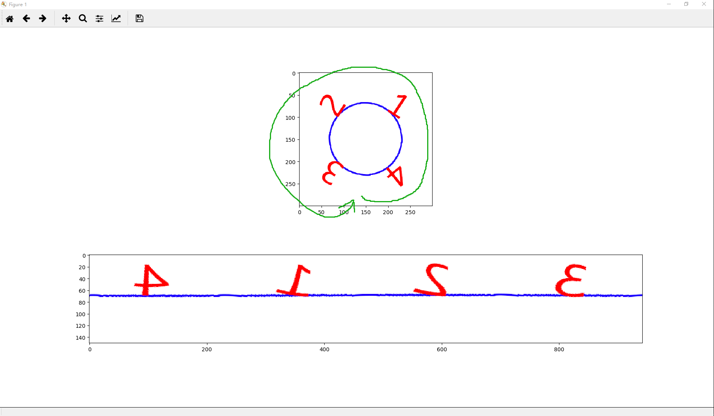
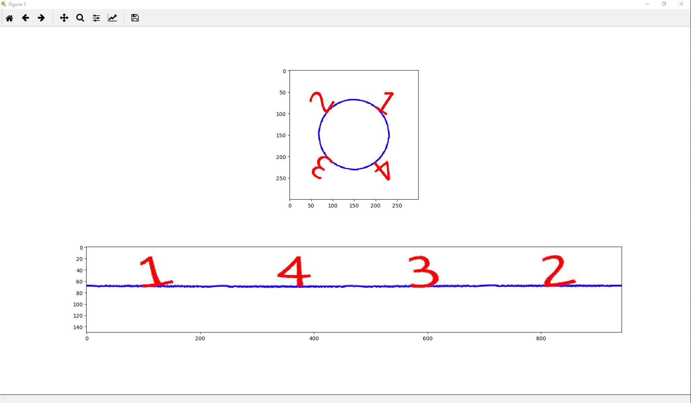

# 20190418-用Python实现全景图像展开

## 1. 前言

最近遇到一个需要提取环状图像上目标的小任务，一般在这种情况下通过全景展开操作可以对其进行更好地后续分析，以下图为例：



在文章[《图像处理之极坐标全景图》](<https://zhuanlan.zhihu.com/p/29218780>)中有较为详细的阐述，但个人认为不太简洁。在此文中将结合Python代码并试图给一个概要性的解释。

## 2. 理论

事实上只需回忆初中的极坐标变换公式：
$$
x = r * cosθ
$$

$$
y = r * sinθ
$$

但上面的公式仅适合标准直角坐标系，而图像却并非围绕其起点展开，换句话说其中心在图像上某一点，而该点即使我们的展开中心：
$$
x = r * cosθ + x0
$$

$$

y = r * sinθ + y0
$$

并且因为我们需要将一个标准的圆形区域展开为矩形区域，而展开后的矩形区域高度即是圆形区域的半径```radius```，展开后的矩形区域长度自然是```2 * π * radius```！

因此全景展开无非通过原图中需要被展开的圆形区域参数（半径radius）构造展开后的矩形区域，然后根据坐标映射关系将像素值依次填充进去即可。

## 3. 实现

### 3.1 导入所需的包

```python
import numpy as np
import math
import cv2
```

### 3.2 导入待展开的图像

```python
img = cv2.imread("panoramagram.png")
cv2.imshow("panoramagram", img)
```

## 3.3 获取展开参数并构造展开后的图像

此处用到的图是一个标准的正方形，因此半径参数radius直接取边长的一半即可，处理其它任意尺寸的图像在原理上一致，只需关注待展开的圆形区域即可。

```python
# 得到圆形区域的中心坐标
x0 = img.shape[0] // 2
y0 = img.shape[1] // 2
# 通过圆形区域半径构造展开后的图像
unwrapped_height = radius = img.shape[0] // 2
unwrapped_width = int(2 * math.pi * radius)
unwrapped_img = np.zeros((unwrapped_height, unwrapped_width, 3), dtype="u1")
```

### 3.4 全景展开

由于在展开过程中难免遇到超出原图边界的情况发生，因此加入了捕获异常的代码。

```python
except_count = 0
for j in range(unwrapped_width):
    theta = 2 * math.pi * (j / unwrapped_width)  # 1. start position such as "+ math.pi"
    for i in range(unwrapped_height):
        unwrapped_radius = radius - i  # 2. don't forget
        x = unwrapped_radius * math.cos(theta) + x0  # 3. "sin" is clockwise but "cos" is anticlockwise
        y = unwrapped_radius * math.sin(theta) + y0
        x, y = int(x), int(y)
        try:
            unwrapped_img[i, j, :] = img[x, y, :]
        except Exception as e:
            except_count = except_count + 1
print(except_count)
```

### 3.5 保存展开后的图像

```python
cv2.imwrite("unwrapped.jpg", unwrapped_img)
cv2.imshow("Unwrapped", unwrapped_img)
cv2.waitKey(0)
```

## 4. 重点讲解

回到3.4部分的代码，主要有三点需要说明：

* 在注释1处（j/unwrapped_width）即每一步占整个圆周2π的比例，此外可通过添加额外的选项调节起点
* 在注释2处尤其不要忘记，因为在展开过程中对于每一步的j，r都是一个从外向内动态变化的参数
* 其实对一个是```r*sinθ```，对另一个一定是```r*cosθ```，可以尝试两者互换会表现出顺逆时针的差别

## 5. 展示

利用plt绘图，对于注释1处无偏移项，且x对应cos、y对应sin的效果如下：

```python
import matplotlib.pyplot as plt

for j in range(unwrapped_width):
    theta = 2 * math.pi * (j / unwrapped_width)  # no offset
    for i in range(unwrapped_height):
        unwrapped_radius = radius - i
        x = unwrapped_radius * math.cos(theta) + x0  # "cos" is anticlockwise
        y = unwrapped_radius * math.sin(theta) + y0
        x, y = int(x), int(y)
        try:
            unwrapped_img[i, j, :] = img[x, y, :]
        except:
            continue

plt.subplot(2, 1, 1); plt.imshow(img[:, :, ::-1])
plt.subplot(2, 1, 2); plt.imshow(unwrapped_img[:, :, ::-1])
plt.show()
```



可见其做了逆时针展开，得到了镜像的4→1→2→3。

但对于人眼的感受，可能希望得到正向的1→4→3→2，只需要对代码稍加变化即可：

```python
for j in range(unwrapped_width):
    theta = 2 * math.pi * (j / unwrapped_width) - 1 / 2 * math.pi  # + math.pi
    for i in range(unwrapped_height):
        unwrapped_radius = radius - i
        x = unwrapped_radius * math.sin(theta) + x0  # "sin" is clockwise
        y = unwrapped_radius * math.cos(theta) + y0
        x, y = int(x), int(y)
        try:
            unwrapped_img[i, j, :] = img[x, y, :]
        except:
            continue

plt.subplot(2, 1, 1); plt.imshow(img[:, :, ::-1])
plt.subplot(2, 1, 2); plt.imshow(unwrapped_img[:, :, ::-1])
plt.show()
```

