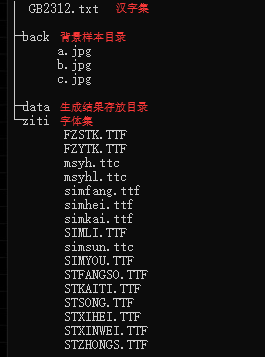

# 20190811-用Python生成中文汉字数据集

## 1. 前言

近期实现一个中文汉字分类的小项目，但尝试的时候却发现没有完全场景适用的数据集（主要是背景的繁复上），思索再三给出一种利用GB2312字符集（覆盖了6763个常用汉字）自动生成中文汉字数据集的方法，当然如果还需识别更多的低频汉字可寻找《汉语大字典》（共计数万个汉字）。

## 2. 准备

如下图所示：



其中主要包括三大部分：1. 用到的字体（可根据需要自行网络下载补充）；2. 裁剪好的背景图像（可根据项目场景自行定义）；3. GB2312汉字集。

## 3. 实现

### 3.1 环境准备

```python
from PIL import Image, ImageDraw, ImageFont, ImageFilter
import numpy as np
import glob as gb
import shutil
import cv2
import os
```

其中主要用到了numpy和PIL库，本打算不用opencv但试了一下发现难以实现汉字的错切也没能找到合适的中文斜体字，当然直接用PIL库的主要目的是其对中文路径支持比较好，方便写入对应的汉字目录。

### 3.2 字体集尺寸设置及目录准备

没什么好说的，直接上代码：

```python
# 汉字集图像尺寸
height, width = 64, 64
ziti_size = height // 4 * 3
hanzi_size = (height, width)
hanzi_shape = (height, width, 3)

# 准备生成目录
data_directory = "data"
if os.path.exists(data_directory):
    shutil.rmtree(data_directory)
    os.makedirs(data_directory)
```

### 3.3 背景和汉字的生成

```python
# 背景准备
back_directory = "back"
def gener_back():
    back_imgpaths = gb.glob(os.path.join(back_directory, "*"))
    total_bakimgs = len(back_imgpaths)
    while True:
        yield Image.open(back_imgpaths[np.random.randint(total_bakimgs)]).resize(hanzi_size)

# 汉字生成
ziti_directory = "ziti"
def gener_ziti(zi, n=3):
    ziti_paths = gb.glob(os.path.join(ziti_directory, "*"))
    ziti_total = len(ziti_paths)
    while True:
        if n <= 0:
            break
        else:
            n -= 1
        # 添加字
        _img = Image.fromarray(np.zeros(hanzi_shape, dtype="u1"))
        font = ImageFont.truetype(ziti_paths[np.random.randint(ziti_total)], ziti_size, encoding="utf-8")
        r, g, b = np.random.randint(150, 255), np.random.randint(150, 255), np.random.randint(150, 255)
        draw = ImageDraw.Draw(_img)
        draw.text((5, 5), zi, (r, g, b), font=font)
        # 若不使用旋转可注释掉
        _img = _img.rotate(np.random.randint(-45, 45))
        # 若不使用模糊可注释掉
        _img = _img.filter(ImageFilter.GaussianBlur(radius=0.7))
        # 若不使用错切可注释掉
        theta = np.random.randint(-15, 15) * np.pi / 180
        M_shear = np.array([[1, np.tan(theta), 0], [0, 1, 0]], dtype=np.float32)
        _img = Image.fromarray(cv2.warpAffine(np.array(_img), M_shear, hanzi_size))
        yield _img
```

在这里使用了yield关键词，可根据情况另行搜索文章重点掌握以下，此处最大的好处是方便随机生成，当然其它功能如节省内存之类此处不表。

### 3.4 汉字集生成

有了前面的准备，就可以遍历所有汉字生成整个数据集啦！

```python
# 数据集
data_directory = "data"
with open("GB2312.txt", 'r', encoding="utf-8") as fr:
    zi_sets = fr.read()
for i, zi in enumerate(zi_sets):
    # 目录准备
    zi_directory = os.path.join(data_directory, zi)
    if not os.path.exists(zi_directory):
        os.makedirs(zi_directory)
    # 开始生成
    for serial, (ziti, back) in enumerate(zip(gener_ziti(zi, n=5), gener_back())):  # n=5, 生成5张/字体
        img = Image.fromarray(np.array(ziti) // 5 * 3 + np.array(back) // 5 * 2)
        img_path = os.path.join(zi_directory, str(serial) + ".jpg")
        img.save(img_path, "JPEG")
    # 调试时用于控制生成汉字种类个数
    if i > 3:
        break
```

注意可以通过设置 n 的值控制每个字生成多少张，还有最后处通过 i 控制演示生成多少个，实际用的时候注释掉就OK啦！

### 3.5 结果

最后看一下生成的结果吧 :)

