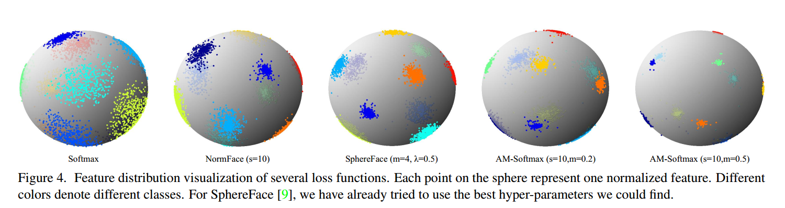
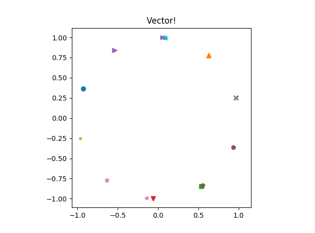

# 20191001-使用Keras演示基于AAM-Softmax的图像识别原理

## 1. 前言

视觉领域内基本的深度学习方法无非包括：分类识别、目标检测、语义分割等。其中尤以分类识别最容易被人混淆，大多数人都以为两者是统一的概念，但实际上却天差地别。可以这么讲，“识别”出于“分类”而胜于“分类”！

以应用最广泛的人脸识别来讲，假如你需要针对公司做一个基于视觉的打卡应用，初学者最直观地想象无非是这不简单，采集好所有人的头像然后做分类不就搞定了！但是，如果公司的人员变动非常大，你岂不得每天都要在这上面耗时耗力耗资源了？难以更新和维护，这体验得多差啊！

众所周知，图像分类深度学习模型可以被表达为：特征提取器+分类器。分类器好说，把提取好的特征画一道道的分界线就完成任务了，近年最厉害最大的突破就在于这个特征提取器。参考[《Additive Margin Softmax for Face Verification》]( http://arxiv.org/abs/1801.05599 )中给出的一张图如下所示：




最左边的就是最原始的基于Softmax训练后抽取到的特征进行三维可视化的结果，这样的特征除了能用于分类之外毫无用处。想象一下如果同一个类别经过前面特征提取器的输出都能尽可能地是同一个特征向量该有多好，就像一个人无论年轻还是老去，素颜还是化妆，但都只有一个唯一标识的身份证号。即便达不到这样的要求，那能尽可能地接近也行啊，这样通过相似度就能比较了！这就是上图中靠右的方法结果。但是实际应用过程中训练时的类别太少了可能还不行，如果有几万、几十万甚至上百万的类别统统给这样训练一下，每个类别都被表达地非常紧凑，那岂不相当于拥有了针对此类数据集的完美编码器呢？所以传统的分类器某种程度上只完成了一小部分，而识别则再此基础上迈出了更远的一步：最大化类间距离，最小化类内距离。

在这方面的探索比较成功的有两类方法如下。


但度量学习既有组合爆炸等的问题又非常难以学习，所以基于最大化间隔的分类器自然成了当前的主流，相比传统的图像分类只需要替换末尾的softmax改成自定义层，训练过程无需任何变化，但训练的结果却可以用来处理识别问题，岂不美哉！

## 2. 利用Keras自定义层并搭建简单的序列模型

在本文中是通过MNIST数据集作为演示，前面也提到过与搭建传统分类器的最大差别就在于模型的最后一层需要自己动手实现，个中的原理在网上已有非常多的推理，此处不表，所有代码如下：

```python
# 参考1: https://keras.io/zh/layers/writing-your-own-keras-layers/
# 参考2: https://github.com/4uiiurz1/keras-arcface
from keras.layers import Layer, InputLayer, Conv2D, MaxPooling2D, Flatten, Dense, Dropout
from keras.layers import regularizers, BatchNormalization
from keras.models import Sequential
from keras.utils import plot_model
from keras.optimizers import Adam
from keras import backend as K


# Layer
class ArcLayer(Layer):
    def __init__(self, output_dim, s=30.0, m=0.5, regularizer=None, **kwargs):  # 初始化
        if 'input_shape' not in kwargs and 'input_dim' in kwargs:
            kwargs['input_shape'] = (kwargs.pop('input_dim'),)
        super(ArcLayer, self).__init__(**kwargs)
        self.output_dim = output_dim
        self.s = s
        self.m = m
        self.W = None
        self.regularizer = regularizers.get(regularizer)

    def build(self, input_shape):  # 定义本层的权
        assert len(input_shape) >= 2
        input_dim = input_shape[-1]
        self.W = self.add_weight(name="kernel",
                                 shape=(input_dim, self.output_dim),
                                 initializer='glorot_uniform',
                                 regularizer=self.regularizer,
                                 trainable=True
                                 )
        self.bias = None
        self.built = True

    def call(self, inputs, **kwargs):  # 实现本层从输入张量到输出张量的计算图
        inputs = K.tf.nn.l2_normalize(inputs, 1, 1e-10)  # X 归一化
        self.W = K.tf.nn.l2_normalize(self.W, 0, 1e-10)  # W 归一化
        # cos(θ) --------------------------------------------------------------
        cos_theta = K.dot(inputs, self.W)
        # CosFace ====================== 余弦距离 =====================
        # phi = cos_theta - self.m
        # ArcFace ====================== 角度距离 =====================
        # controls the (theta + m) should in range [0, pi]
        theta = K.tf.acos(K.clip(cos_theta, -1.0+K.epsilon(), 1.0-K.epsilon()))
        phi = K.tf.cos(theta + self.m)
        # e^φ -----------------------------------------------------------------
        e_phi = K.exp(self.s * phi)
        e_cos = K.exp(self.s * cos_theta)
        # output
        output = e_phi / (e_phi + (K.sum(e_cos, axis=-1, keepdims=True)-e_cos))
        return output

    def compute_output_shape(self, input_shape):  # 指定输入及输出张量形状变化的逻辑!
        return input_shape[0], self.output_dim


# Loss
def loss_defined(y_true, y_pred):
    loss = -K.mean(K.log(K.clip(K.sum(y_true * y_pred, axis=-1), K.epsilon(), None)), axis=-1)
    return loss


# model
def build_net():
    model = Sequential([InputLayer(input_shape=(28, 28, 1)),

                        Conv2D(32, (3, 3), activation='relu'),
                        Conv2D(32, (3, 3), activation='relu'),
                        BatchNormalization(),
                        MaxPooling2D(pool_size=(2, 2)),

                        Conv2D(64, (3, 3), activation='relu'),
                        Conv2D(64, (3, 3), activation='relu'),
                        BatchNormalization(),
                        MaxPooling2D(pool_size=(2, 2)),

                        Flatten(),
                        Dropout(0.25),
                        Dense(128, activation='relu'),

                        Dense(2, name="feature_embedding"),
                        ArcLayer(10, s=30.0, m=0.5)  # CosFace: s=24, m=0.2
                        ])
    # -------------------------------------
    model.summary()
    model.compile(loss=loss_defined, optimizer=Adam(), metrics=['accuracy'])
    return model


if __name__ == "__main__":
    model = build_net()
    plot_model(model, to_file="./model.png", show_shapes=True)

```

首先说一下在Keras中的自定义层，无非就是要继承并重写 build、call、compute_output_shape 这三个方法。众所周知，深度学习模型的基本单位一定是“层”，所以 build 方法就是这个层中定义权重的地方，并指定哪些参数可训练哪些不需要之类。其次是 call 方法，用于实现改成的计算逻辑，说白了就是结合权重等怎么把输入变化到输出的过程。最后还有个 compute_output_shape 的方法，很简单，就是为了能显示打印输入输出张量的 shape 。

为了对比说明 CosFace 和 ArcFace，在上面的 call 方法中进行了对比，如果需要使用 CosFace 就注释掉下面关于 phi 的计算逻辑而改用上面的即可。

有了自定义的层，那实现模型的时候，只需要把传统分类器的最后一层进行替换即可，其它无需任何变化！

## 3. 训练及演示

此处用了MNIST数据集进行训练，训练完成后只需要对数据抽取特征向量并可视化即可，具体代码如下：

```python
from aam_softmax_model import build_net
from keras.preprocessing import image
import matplotlib.pyplot as plt
from keras.models import Model
import pandas as pd
import numpy as np
import glob as gb
import os

# 准备
data = []
model_path = "./model.h5"
datasets_path = "./datasets/mnist_test"
# 加载
model = build_net()
model.load_weights(model_path)
vec_layer = Model(inputs=model.input, outputs=model.get_layer("feature_embedding").output)
# 计算
category_path = gb.glob(os.path.join(datasets_path, "**/"))
for category in category_path:
    y = int(category.split(os.sep)[-2])
    for idx, img_path in enumerate(gb.glob(os.path.join(category, "*"))):
        if idx >= 5:
            break
        img = image.load_img(img_path,
                             target_size=(28, 28),
                             grayscale=True,
                             )
        x = image.img_to_array(img)
        x *= 1./255
        x = np.expand_dims(x, axis=0)
        x2vec = vec_layer.predict(x)
        X_y = x2vec.flatten()
        X_y /= np.linalg.norm(X_y)  # 归一化：可不进行归一化即注释后对比观察
        X_y = X_y.tolist()
        X_y.append(y)
        data.append(X_y)
data = pd.DataFrame(data)
# 存储
# data.to_csv("vec.csv", sep='\t', header=False, index=False, float_format="%.7f")
# 显示
data[2] = data[2].astype('int')
classes = []
colors = ['tab:red', 'tab:green', 'tab:blue', 'tab:orange', 'tab:olive', 'tab:cyan', 'tab:purple', 'tab:brown', 'tab:pink', 'tab:gray']
markers = ['v', ',', 'o', '^', '.', '<', '>', 'p', '*', 'x']
for i in range(data[2].max() + 1):
    classes.append(data.loc[data[2] == i])
    plt.scatter(classes[i][0], classes[i][1], color=colors[i], marker=markers[i])
plt.title("Vector!")
plt.axis("square")
plt.show()

```




这儿对每个类别选取了五个数据进行展示，可以看到抽取到的特征是不非常紧凑呢？当然由于用到的模型非常简陋而且被压缩到两个维度，有几个类别出现了偏差，具体应用肯定需诸多调优的。

回到最初的提问，想象一下已经成功实现并训练好了这么一个强大的特征提取器 / 编码器，在实际生产时针对一个场景，第一步先有多少类别就先抽取并保存好对应的特征向量，第二步应用的时候只需用实时抽取到的特征向量与预录入的所有特征向量比较余弦相似度做查询即可！

题外话，像现今的很多客服机器人、聊天机器人啥的是不同一个道理呢？预先根据业务场景建立一个尽量完备的问答知识库，然后再仅针对“问”这一块儿设计一个识别模型能够把表达不同但含义相同的句子映射到相似的特征向量上去，接下来只需查找到预设计好的回答岂不就很有AI的味道了！

## 4. 附注

文中代码已上传至：https://github.com/atlantistin/Blogs/tree/master/20191001-keras-AAMsoftmax-mnist